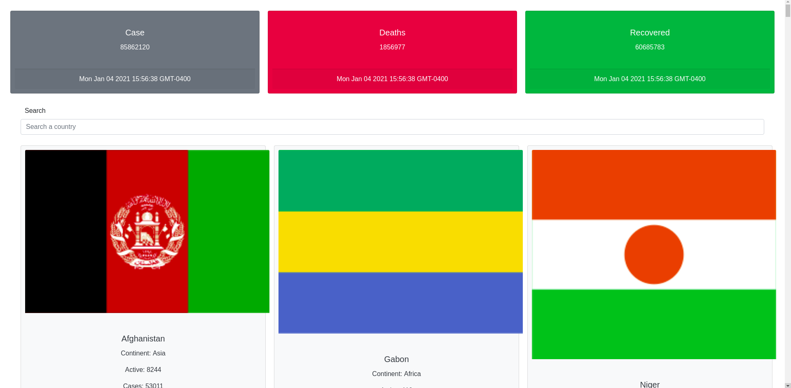

# COVID-19 Tracker

## Installation

Use the package control version [git](https://git-scm.com/downloads) and [node](https://nodejs.org/en/).

```bash
git clone https://github.com/Victor1890/COVID-19-Tracker.git
```

```bash
cd COVID-19-Tracker
```


## Library using in the project

1. [Axios](https://github.com/axios/axios)
2. [React Bootstrap](https://react-bootstrap.github.io/)
3. [React Moment](https://www.npmjs.com/package/react-moment)

## Usage

Using VSCode like IDE, open the `COVID-19-Tracker` run the following commands

In order to install the dependencies

```bash
npm install
```

In order to start in mode development

```bash
npm start
```

## Screenshot



## License
[MIT](https://choosealicense.com/licenses/mit/)